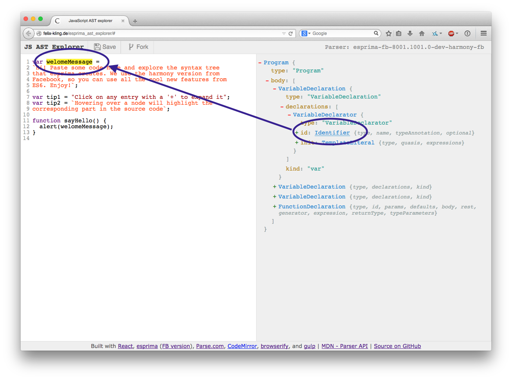
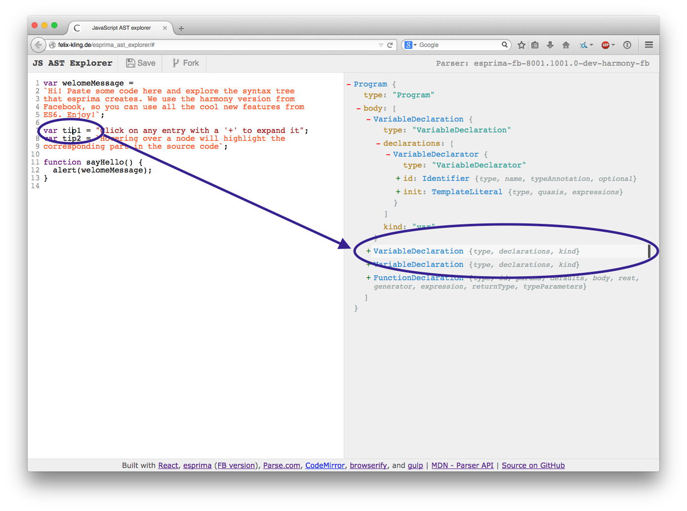

## A JavaScript AST explorer

Paste JavaScript code into the editor and inspect the generated AST.

The JS AST explorer uses [esprima-fb](https://github.com/facebook/esprima) to parse the
code, so it not only supports current JS (ES5), but also

- ES6: [arrow functions](https://github.com/lukehoban/es6features#arrows), [destructuring](https://github.com/lukehoban/es6features#destructuring),
  [classes](https://github.com/lukehoban/es6features#classes), ...
- ES7 propsals: [async/await](https://github.com/lukehoban/ecmascript-asyncawait), [object rest / spread](https://github.com/sebmarkbage/ecmascript-rest-spread),  ...
- [JSX](https://facebook.github.io/jsx/), known through [React](https://facebook.github.io/react/).
- Typed JavaScript ([Flow](http://flowtype.org/))

Since future syntax is supported, the JS AST explorer is a useful tool for
developers who want to create AST transforms, e.g. with
[recast](https://github.com/benjamn/recast).

### Features

- Save and fork code snippets. Copy the URL to share them.
- Hovering over a node highlights the corresponding text in the source code:

- Editing the source or moving the cursor around will automatically highlight the
corresponding AST node (or its ancestors of it isn't expanded):

### Contributions

I'm happy about any feedback, feature request or PR to make this tool as useful
as possible!

#### Build your own version

Install gulp with `npm install -g gulp` and all dependencies with `npm install`.
Run `gulp watch` for incremental builds (while hacking the code), and
`gulp build` for the final minimized version.
